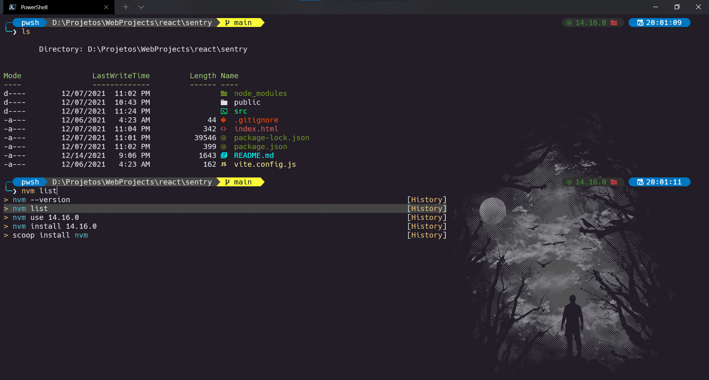

# Beautify your Windows Terminal and Powershell
Step-by-step tutorial to customize the Windows Terminal and Powershell Core



# Getting Started

## Install Hack (Nerd Fonts)
Download the `Hack` font from [Nerd Fonts](https://github.com/ryanoasis/nerd-fonts/releases/tag/v2.1.0).

> Otherwise you will see some gibberish on your terminal.

> Install all `Windows compatible` .ttf files.

## Install Powershell Core

Download the latest release of `Powershell Core` from [Github Repo](https://github.com/PowerShell/PowerShell).

## Install Windows Terminal

You can download the `Windows Terminal` from [Microsoft Store](https://www.microsoft.com/en-us/p/windows-terminal/9n0dx20hk701).

Or you can download using `Invoke-WebRequest` command:

```powershell
Invoke-WebRequest -Uri https://github.com/microsoft/terminal/releases/download/v1.5.10411.0/Microsoft.WindowsTerminal_1.5.10411.0_8wekyb3d8bbwe.msixbundle -OutFile WindowsTerminal.appx -UseBasicParsing
```

```powershell
Add-AppxPackage .\WindowsTerminal.appx
```

# Windows Terminal Setup
My Windows Terminal configuration for References:
```json
// To view the default settings, hold "alt" while clicking on the "Settings" button.
// For documentation on these settings, see: https://aka.ms/terminal-documentation
{
    "$schema": "https://aka.ms/terminal-profiles-schema",
    "actions": [
        {
            "command": {
                "action": "copy",
                "singleLine": false
            },
            "keys": "ctrl+c"
        },
        {
            "command": "paste",
            "keys": "ctrl+v"
        },
        {
            "command": "find",
            "keys": "ctrl+shift+f"
        },
        {
            "command": {
                "action": "splitPane",
                "split": "auto",
                "splitMode": "duplicate"
            },
            "keys": "alt+shift+d"
        }
    ],
    "copyFormatting": "none",
    "copyOnSelect": false,
    "defaultProfile": "{574e775e-4f2a-5b96-ac1e-a2962a402336}",
    "launchMode": "maximized",
    "profiles": {
        "defaults": {
            // Don't forget to change "backgroundImage"
            "backgroundImage": "D:\\User Images\\terminal.jpg",
            "backgroundImageOpacity": 0.5,
            "colorScheme": "One Half Dark",
            "font": {
                "face": "Hack NF",
                "size": 14
            }
        },
        "list": [
            {
                "commandline": "powershell.exe",
                "guid": "{61c54bbd-c2c6-5271-96e7-009a87ff44bf}",
                "hidden": false,
                "name": "Windows PowerShell"
            },
            {
                "commandline": "cmd.exe",
                "guid": "{0caa0dad-35be-5f56-a8ff-afceeeaa6101}",
                "hidden": false,
                "name": "Command Prompt"
            },
            {
                "guid": "{b453ae62-4e3d-5e58-b989-0a998ec441b8}",
                "hidden": false,
                "name": "Azure Cloud Shell",
                "source": "Windows.Terminal.Azure"
            },
            {
                "guid": "{574e775e-4f2a-5b96-ac1e-a2962a402336}",
                "hidden": false,
                "name": "PowerShell",
                "source": "Windows.Terminal.PowershellCore",
                // Don't forget to change "startingDirectory"
                "startingDirectory": "D:\\"
            }
        ]
    },
    "schemes": 
    [
        {
            "background": "#282C34",
            "black": "#282C34",
            "blue": "#61AFEF",
            "brightBlack": "#5A6374",
            "brightBlue": "#61AFEF",
            "brightCyan": "#56B6C2",
            "brightGreen": "#98C379",
            "brightPurple": "#C678DD",
            "brightRed": "#E06C75",
            "brightWhite": "#DCDFE4",
            "brightYellow": "#E5C07B",
            "cursorColor": "#FFFFFF",
            "cyan": "#56B6C2",
            "foreground": "#DCDFE4",
            "green": "#98C379",
            "name": "One Half Dark",
            "purple": "#C678DD",
            "red": "#E06C75",
            "selectionBackground": "#FFFFFF",
            "white": "#DCDFE4",
            "yellow": "#E5C07B"
        }
    ]
}
```

> **Obs**: Don't forget to change `"backgroundImage"` on defaults Profile and `"startingDirectory"` on Powershell Core Profile

# Prompt Setup
The next codes you must run them inside Powershell Core prompt.

Install `oh-my-posh`:
```powershell
Install-Module posh-git -Scope CurrentUser -Force
Install-Module oh-my-posh -Scope CurrentUser -Force
```

> **Obs**: You must have installed [`Git for Windows`](https://git-scm.com/downloads).

## Customize your Powershell Profile
You can open your Powershell Profile with the command below:
```powershell
notepad $PROFILE.CurrentUserCurrentHost
```

Now go ahead and add the following code to your Powershell Profile:
```
Import-Module posh-git
Import-Module oh-my-posh
```

## Create the custom theme

Open **oh-my-posh** `themes` folder:

```
Documents\PowerShell\Modules\oh-my-posh\themes
```
> **Obs**: Sometimes will be `~\AppData\Local\oh-my-posh\themes`.

paste the **`minimal.omp.json`** file.

> **Obs**: `minimal.omp.json` is located in `.config\terminal` folder on this repo.

Open `$PROFILE` file again, then add:

```
Set-PoshPrompt -Theme minimal
```

# Install PSReadLine and Terminal Icons

```powershell
Install-Module -Name PSReadLine -AllowPrerelease -Scope CurrentUser -Force -SkipPublisherCheck
```

```powershell
Install-Module -Name Terminal-Icons -Repository PSGallery -Force
```

Open `$PROFILE` file again, then add:

```powershell
# Icons
Import-Module -Name Terminal-Icons

# PSReadLine
Set-PSReadLineOption -PredictionSource History
Set-PSReadLineOption -PredictionViewStyle ListView
```

> **Obs:** You can clear the `PSReadLine history` by cleaning the history file.

>You can get the path using `(Get-PSReadlineOption).HistorySavePath` command.

# Final Result


# Useful Resources
[How to set up PowerShell prompt with Oh My Posh on Windows 11](https://www.youtube.com/watch?v=5-aK2_WwrmM)

[NerdFonts - Glyphs/Icons Cheat Sheet](https://www.nerdfonts.com/cheat-sheet)

[Oh My Posh THEMES](https://ohmyposh.dev/docs/themes/)

[oh-my-posh repository](https://github.com/JanDeDobbeleer/oh-my-posh)
